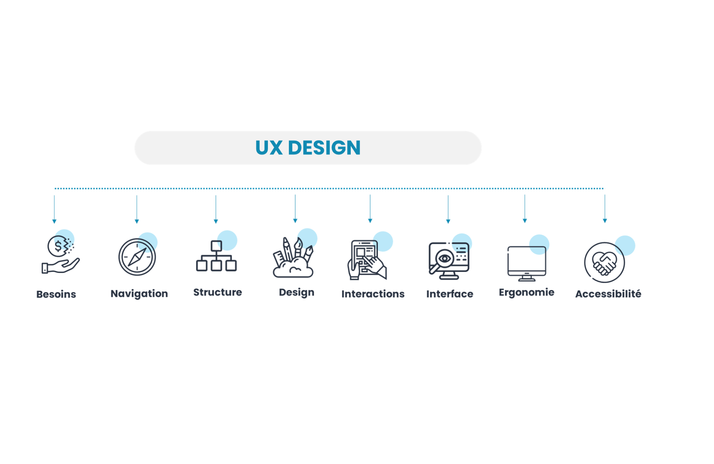
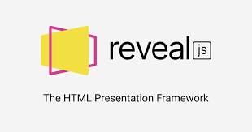
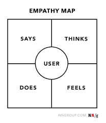
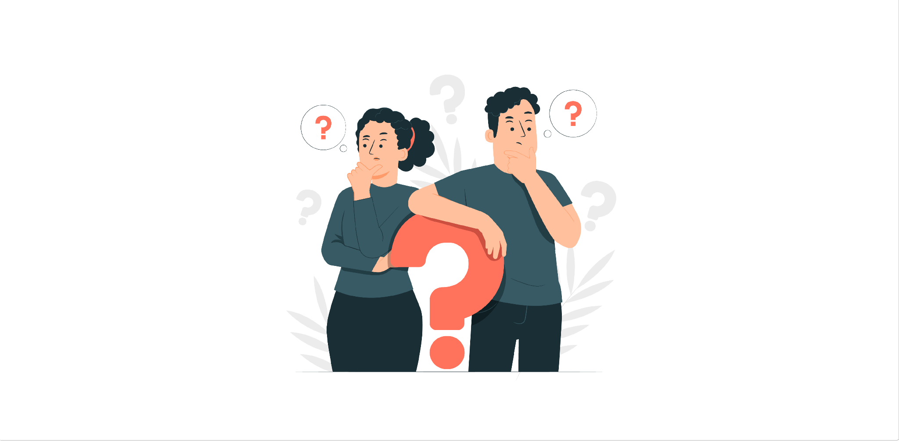

### Introduction

 
 
---

### PROJET_SOLI-LMS

---

### Apprentissage

---
###  Plan

| Day            |     1       |         2               |        3         | 
|------------    |-------------|-------------------------|------------------|
| **Monday**     | tuto1       |   tuto1                 |   tuto1          | 
| **Tuesday**    |      __     |       ___               |   tuto2          | 
| **Wednesday**  |   EMPATHIE  |   DEFINITION              |    IDEATION    | 
| **Thursday**   | REALISATION |     FILL ROUGE          |    REALISATION/ TEST    |
| **Friday**     | TEST /VALIDATION       |    TEST / VALIDATION     |      FILL ROUGE /tuto3           |

---
### Empathie

--
 #### formateur

--
 #### apprenent

---
### Definition

---
### ideation 

---
### cas d'utulisation
---
### diagrame du class 
---
### realisation
---
### conclution