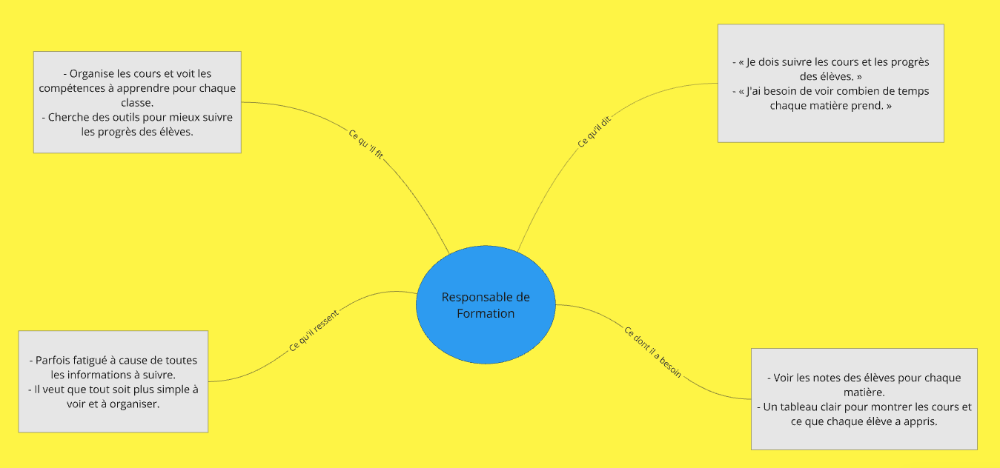
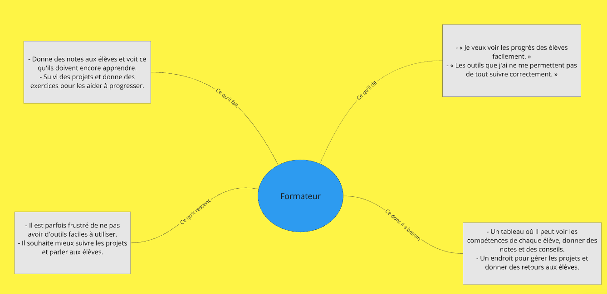
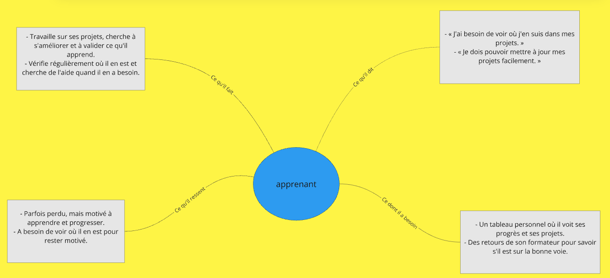
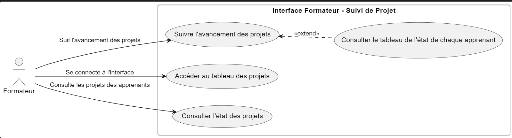

## Introduction

- Le suivi de projet est très important pour voir si un programme de formation fonctionne bien et si les apprenants progressent. Pour le projet Soli-LMS, le package suivi_projet a été créé afin que les formateurs puissent suivre l’état général des projets de leurs apprenants. Ce package permet de connaître le nombre d’apprenants qui ont terminé leur parcours, ceux qui sont en cours et ceux qui n’ont pas encore commencé.

- En plus, suivi_projet offre la possibilité de suivre chaque apprenant individuellement, ce qui aide les formateurs à mieux comprendre les progrès de chaque participant et à repérer les éventuels obstacles. Grâce à cet outil, les formateurs peuvent prendre de meilleures décisions, apporter un soutien adapté et améliorer l’expérience d’apprentissage dans le cadre de Soli-LMS.

## Emapthy 
 - Cette approche aide chaque personne (Responsable de Formation, Formateur et Apprenant) à mieux comprendre, suivre et s'améliorer grâce à des outils simples et efficaces pour leurs besoins.

   ### responsable du formation

 

   ### Formateur

  

   ### Apprenant
 

## Définition 

Le **pkg_suivi_projet** vise à résoudre le manque d'outils adaptés pour les formateurs en centralisant le suivi des projets des apprenants de manière visuelle et interactive. Il pallie les lacunes des méthodes fragmentées, améliore la visibilité globale et facilite la communication et la gestion des livrables, optimisant ainsi le suivi et le feedback.

Le problème central auquel le **pkg_suivi_projet** cherche à répondre est le manque d'outils adaptés pour permettre aux formateurs de suivre efficacement l'avancement des projets des apprenants de manière visuelle et centralisée. Dans l'état actuel des choses, de nombreux formateurs se retrouvent à utiliser des méthodes fragmentées, comme des feuilles de calcul ou des outils externes, pour gérer et évaluer la progression des projets. Cela entraîne des pertes de temps, des difficultés de coordination, et limite la capacité des formateurs à fournir un feedback régulier et personnalisé.

En particulier :
- **Manque de visibilité globale** : Les formateurs n'ont pas de vue d'ensemble facilement accessible sur l'avancement de tous les projets, ce qui complique l'identification des points de blocage.
- **Faible interactivité** : Les outils existants ne permettent pas une visualisation graphique ou synthétique de l'état des projets, rendant le suivi laborieux et peu motivant.
- **Problèmes de communication** : Les retours aux apprenants et le suivi des livrables peuvent être lents et décousus, ce qui nuit à l'engagement des apprenants et à la qualité du feedback.
- **Complexité de la gestion des livrables** : Suivre et valider les livrables pour chaque projet sans un outil intégré peut rapidement devenir ingérable pour les formateurs, particulièrement avec des cohortes nombreuses.

Le **pkg_suivi_projet** vise à résoudre ces problèmes en offrant aux formateurs une interface centralisée, visuelle et interactive pour consulter et évaluer la progression des projets, à travers des tableaux ou des graphiques. Cette solution améliore non seulement l'efficacité du suivi, mais aussi l'interaction et la motivation des apprenants grâce à un feedback rapide et structuré.

## Idéation

L'idéation du pkg_suivi_projet pour l'interface formateur de Soli-LMS consiste à créer une interface intuitive et centralisée pour suivre l'avancement des projets des apprenants de manière visuelle, via des tableaux ou des graphiques interactifs. Cela inclut des outils de gestion et de feedback en temps réel, permettant une meilleure coordination, visibilité et une communication simplifiée entre les formateurs et les apprenants.

## Cas d'utilisateur

 

## Diagrame du class
